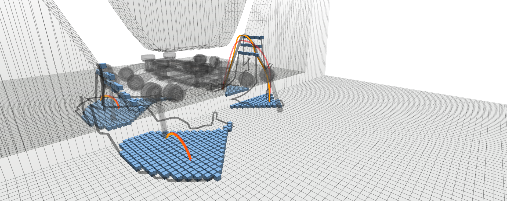
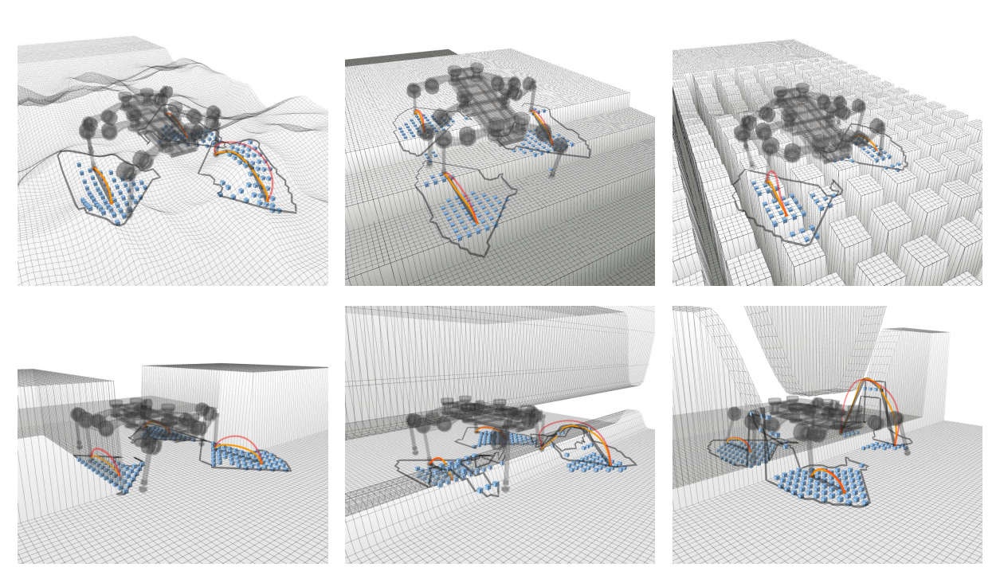
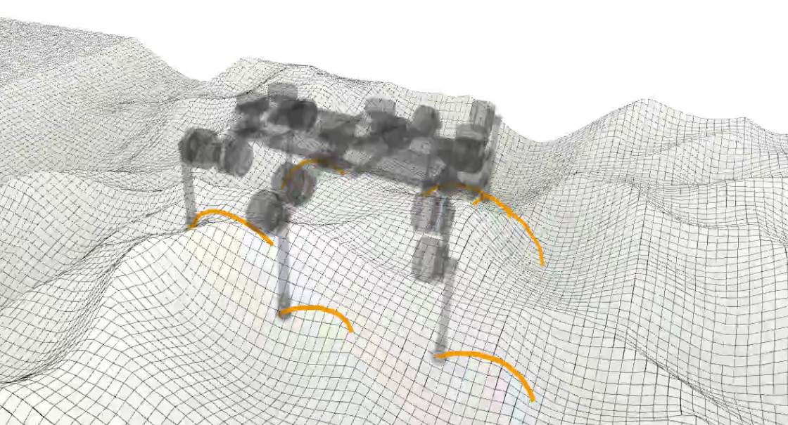

# Fast Legged Trajectory Planner



<!-- NOTE/CAUTION/WARNING -->
> [!NOTE]
> This repo contains codes for paper [_KCFRC: Kinematic Collision-Aware Foothold Reachability Criteria for Legged Locomotion_](https://masteryip.github.io/fltplanner.github.io/).

## Installation

Clone the repository:

```bash
# Under catkin_ws
git clone --recursive https://github.com/MasterYip/FLTPlanner.git
mv FLTPlanner src
cd src
git submodule update --init --recursive
```

Install apt dependencies:

```bash
sudo apt install \
ros-$ROS_DISTRO-ros-industrial-cmake-boilerplate \
ros-$ROS_DISTRO-costmap-2d \
ros-$ROS_DISTRO-ompl \
libglpk-dev
```

Install cddlib manually:

```bash
# Under catkin_ws/src
cd ./legged_traj_planner/third_party
tar -xvf cddlib-0.94m.tar.gz
cd cddlib-0.94m
./configure
make
sudo make install
```

Build the package:

> [!WARNING]
> **DO NOT** install `ros-noetic-grid-map`, `ros-noetic-hpp-fcl` and `ros-noetic-pinocchio` from apt, which will lead to unexpected error.

```bash
# Under catkin_ws
catkin build -j8 legged_traj_plan_examples legged_traj_search_examples robot_assets -DCMAKE_BUILD_TYPE=Release # RelWithDebInfo
source ./devel/setup.bash
```

### Problem Shooting

1. Undefined reference to 'grid_map::GridMap::add()'
    - If you encounter this error, it may be due to the `grid_map` library is linked incorrectly. Make sure you have already uninstall the ros version of `grid_map`: `sudo apt remove ros-noetic-grid-map-*`

## Get Started

### MCTS Contact Planner Examples



Perform **foothold reachability checks** and trajectory optimization using recorded contact sequences or MCTS planner.

```bash
roslaunch legged_traj_plan_examples elspider_air_state_sequence_planner.launch \
robot_interface_type:=ElSpiderAirDummy \
sim:=true \
teleop_type:=keyboard \
demo_name:=4_ushape_barrier \
planner_cfg:=flt_cfg_planner_conv
```

Demos:
`1_stairs`, `2_stairs`, `3_quincuncial_piles`,
`4_barrier`, `4_ushape_barrier`, `5_channel`, `6_fractal`

Planners:
`flt_cfg_planner_keypoint`(KCFRC keypoint), `flt_cfg_planner_conv`(KCFRC conv),
`rrt_cfg_planner`, `stomp_cfg_planner`, `fec_planner`

More configs can be found in:

- [Launch Settings (Demos and Planners)](./legged_traj_planner/legged_traj_plan_examples/launch/elspider_air_state_sequence_planner.launch)
- [State Sequence Planner Configs](./legged_traj_planner/legged_traj_plan_examples/config/planner/state_sequence_planner.yaml)
- Swing Trajectory Planner Configs: In folder `./legged_traj_planner/legged_traj_plan/config/swing_traj_planner`

Robot Control:

- `arrow up`: Move forward
- `arrow down`: Move backward(not recommended)
- `arrow left`: Turn left(not recommended)
- `arrow right`: Turn right(not recommended)

> You can publish `geometry_msgs/Twist` to `/cmd_vel` to control the robot too.

### Raibert Heuristic Planner Examples



Perform trajectory optimization using Raibert heuristic planner.

```bash
roslaunch legged_traj_plan_examples elspider_air_raibert_planner.launch \
robot_interface_type:=ElSpiderAirDummy \
sim:=true \
teleop_type:=PS5
```

```bash
roslaunch legged_traj_plan_examples elspider_air_simple_raibert_planner.launch \
robot_interface_type:=ElSpiderAirDummy \
sim:=true \
teleop_type:=PS5
```

> Use Joystick to control the robot.

### Misc Examples

Examples for algorithm illustration.

<table>
  <tr>
    <td></td>
    <td></td>
  </tr>
</table>

Example List:

- eg_guide_surface_demo
- eg_convoluted_guide_surface_demo
- eg_keypoint_guide_surface_demo
- eg_gcs_barrier_demo
- eg_gcs_barrier_ani_demo
- eg_gcs_rand_corridor_demo
- eg_gcs_rand_map_demo

```bash
roslaunch legged_traj_search_examples gcs_example.launch \
example_name:=eg_gcs_barrier_ani_demo
```

<!-- Examples -->
<!-- <details>
  <summary><b>Setup env</b></summary>

  - Create a Conda env and setup the requirements:

```
conda create -n eg python=3.8
```
</details> -->