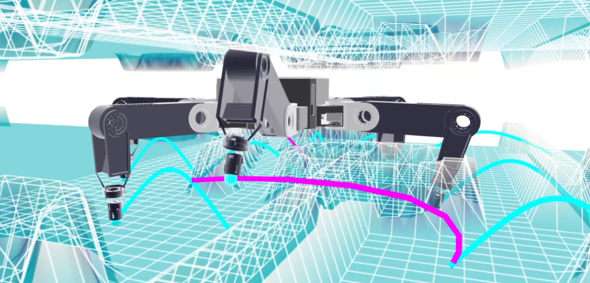
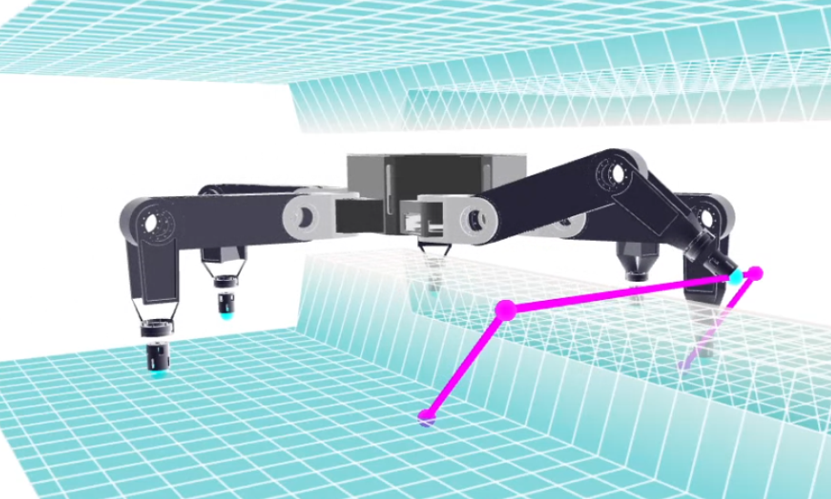
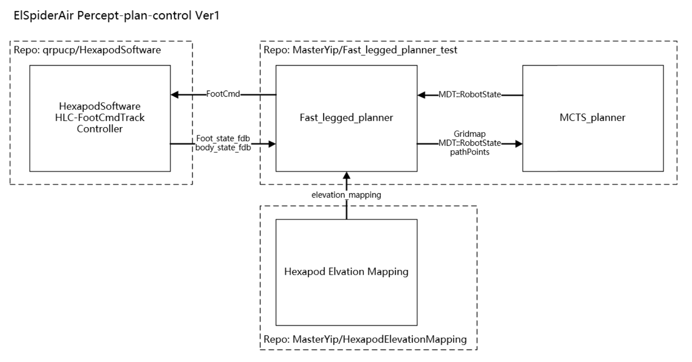
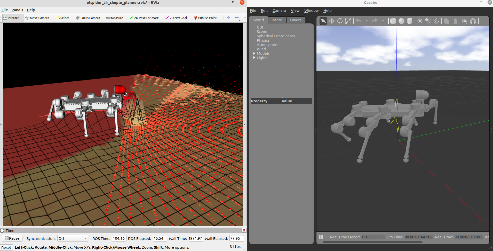

# fast_legged_planner

Test repo for Fast-Legged-Planner

## Setup

### Robotic Course Setup

- `Meshcat` is used for visualization.

- `pinocchio` is used for kinematics and dynamics.

Create and activate conda environment:

```bash
conda env create -f robotic_course_env.yml
```

### Dependancy

##### pinocchio(fast_legged_planner_py needs python binding, optional)

IMPORTANT: Install from source to build pybinding may conflict with legged_control([leggedroobotics/pinocchio](https://github.com/leggedrobotics/pinocchio)) if you have installed it.

In ~/.bashrc:

```bash
# Pinocchio (IMPORTANT: This may interfere with legged_ws-pinocchio)
export PATH=/opt/openrobots/bin:$PATH
export PKG_CONFIG_PATH=/opt/openrobots/lib/pkgconfig:$PKG_CONFIG_PATH
export LD_LIBRARY_PATH=/opt/openrobots/lib:$LD_LIBRARY_PATH
export PYTHONPATH=/opt/openrobots/lib/python3.8/site-packages:$PYTHONPATH # Adapt your desired python version here
export CMAKE_PREFIX_PATH=/opt/openrobots:$CMAKE_PREFIX_PATH
```

##### ompl(fast_legged_planner_py needs python binding, optional)

##### mathgl(for tests, optional)

`sudo apt install libmgl-dev`

##### grid_map

#### MCTS planner

##### glpk

`sudo apt install libglpk-dev`

##### cddlib:

~~`sudo apt install libcdd-dev`~~

[cddlib Homepage](https://people.inf.ethz.ch/fukudak/cdd_home/),
[Github](https://github.com/cddlib/cddlib)

FIXME:

- Cmake warning: link library libcdd.so in /usr/lib/x86_64-linux-gnu may be hidden by files in: /usr/local/lib
- Seems soft link should be established in /usr/lib/x86_64-linux-gnu

Download the most recent tarball from our Releases page and build cddlib with

```bash
tar zxf cddlib-*.tar.gz
cd cddlib-*
./configure
make
sudo make install
```

## User Guide

- [fast_legged_planner_py](./fast_legged_planner_py/README.md)

---

## Examples

### Elspider2 walking with MCTs planner

A complete test for swing trajectory optimization.



```bash
source .setup_rc_nuc11 # setup env (WITH_PINPY = 1)
roslaunch fast_legged_planner HIT_spider_traj_planner.launch
# after rviz is loaded, cd MCTs project(MPI_CPP_Version, branch feature/swing_leg_planner/test)
./bin/parallelMCTS_VirtualLoss # start MCTs planner
```

Several settings is provided in `HIT_spider_traj_planner.launch`, planner settings is in python codes(temporarily).

NOTE: <span style="color:red;">`hexapod_State.msg` has been updated (line 17 and below is newly added), but `parallelMCTS_VirtualLoss` used a old version of `hexapod_State.msg`, so you need to modify it manually.</span>

### Trajectory Optimization Demo

A simple trajectory optimization demo for various planning algorithms(RRT, BFGS, etc.).



```bash
source .setup_rc_nuc11 # setup env (WITH_PINPY = 1)
roslaunch fast_legged_planner traj_opt_demo.launch
```

Several settings is provided in `traj_opt_demo.launch`, planner settings is in python codes(temporarily).

### Purposed(cvxhull) Trajectory Optimization Demo

A simple trajectory optimization demo for GCS-based trajectory optimization.


Coming soon.

### ElSpider Air Co-simulation

A simple co-simulation for ElSpider Air.




#### Dependent Repos

- [Qrpucp/HexapodSoftware](https://github.com/Qrpucp/HexapodSoftware): check out branch `feature/co-simulation`

  ```bash
  git clone --recursive git@github.com:Qrpucp/HexapodSoftware.git
  git checkout feature/co-simulation
  catkin_make -DCMAKE_BUILD_TYPE=Release
  ```

  It needs pinocchio and hpp-fcl, you can install them by:

  ```bash
  # Clone pinocchio
  git clone --recurse-submodules https://github.com/leggedrobotics/pinocchio.git
  # Clone hpp-fcl
  git clone --recurse-submodules https://github.com/leggedrobotics/hpp-fcl.git
  catkin build pinocchio -DCMAKE_BUILD_TYPE=Release
  ```

- [HITSME-HexLab/HexapodElevationMapping](https://github.com/HITSME-HexLab/HexapodElevationMapping): check out branch `feature/co-simulation` or `master`

  ```bash
  git clone --recursive git@github.com:HITSME-HexLab/HexapodElevationMapping.git
  git checkout feature/co-simulation
  catkin build hexapod_elevation_mapping -DCMAKE_BUILD_TYPE=Release
  ```

#### Recommand workspace structure

```txt
├── hexapod_ws
│   ├── build
│   ├── devel
│   └── src
│       └── HexapodSoftware
├── legged_ws
│   ├── build
│   ├── devel
│   ├── logs
│   └── src
│       ├── hpp-fcl
│       └── pinocchio
├── perception_ws
│   ├── build
│   ├── devel
│   ├── logs
│   └── src
│       └── HexapodElevationMapping
└── planner_ws
    ├── build
    ├── devel
    ├── logs
    └── src
        ├── fast_legged_planner
        ├── hexapod_robot_assets
```

#### Get Started

```bash
# Make sure depend repos are properly installed & sourced
catkin build fast_legged_planner -DCMAKE_BUILD_TYPE=Release
# Start HexapodSoftware Gazebo simulation
roslaunch user main.launch \
controller_type:=hlc \
robot_name:=elspider_air \
joystick_type:=keyboard_sim \
gazebo_hang_up:=on_ground \
interface_type:=gazebo
# New terminal, start Planner & elevation mapping
roslaunch fast_legged_planner elspider_air_simple_planner.launch
```

Settings are listed in `elspider_air_simple_planner.launch`.

## Note

- chmod python scripts under /scripts in order to run it

## Interface Explanation

### MCT planner

Needs grid_map with:

- elevation
- normal_x
- normal_y
- normal_z

Messages difinition:

- [FeetPosition.msg](./msg/FeetPosition.msg)
- [hexapod_Base_Pose.msg](./msg/hexapod_Base_Pose.msg)
- [hexapod_RPY.msg](./msg/hexapod_RPY.msg)
- [hexapod_State.msg](./msg/hexapod_State.msg)

### HexapodSoftware

HLC (High Level Controller)

Msg difinition:

- [FootCmd.msg](./msg/FootCmd.msg)
- [FootState.msg](./msg/FootState.msg)
- [Euler.msg](./msg/Euler.msg)
- [BodyState.msg](./msg/BodyState.msg)
