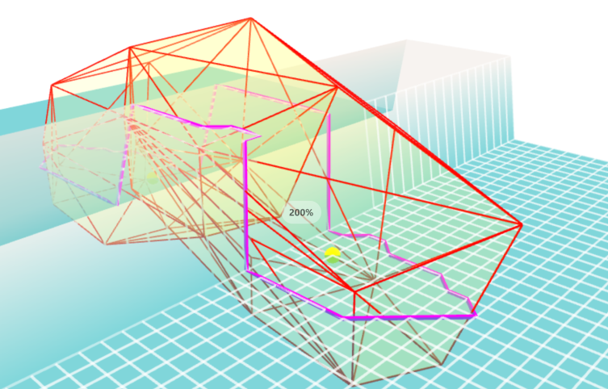

# GCS path search

## Dependencies

- CGAL: `sudo apt install libcgal-dev`

## Examples

### Reachability Analysis

#### Intersection Path Search



```bash
catkin build gcs_path_search -DCMAKE_BUILD_TYPE=Release
roslaunch gcs_path_search gcs_intersection_search.launch
```

### VisibilityGraph Path Search
