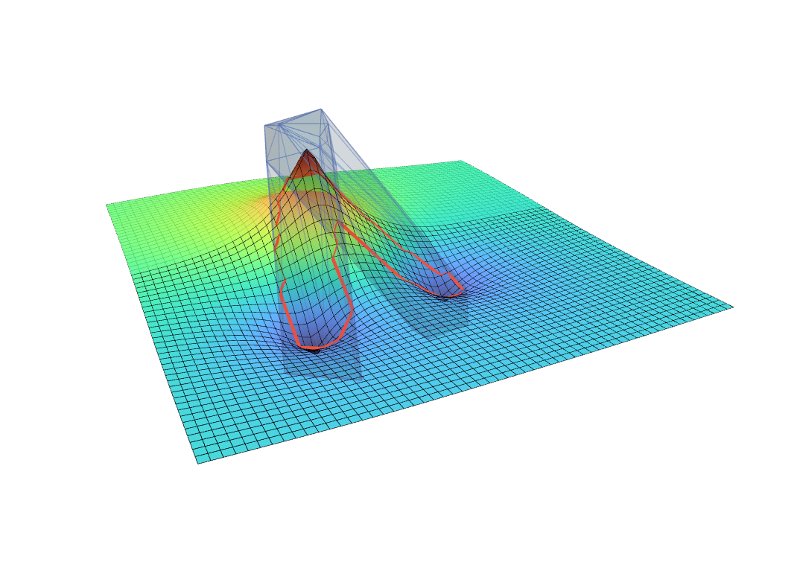
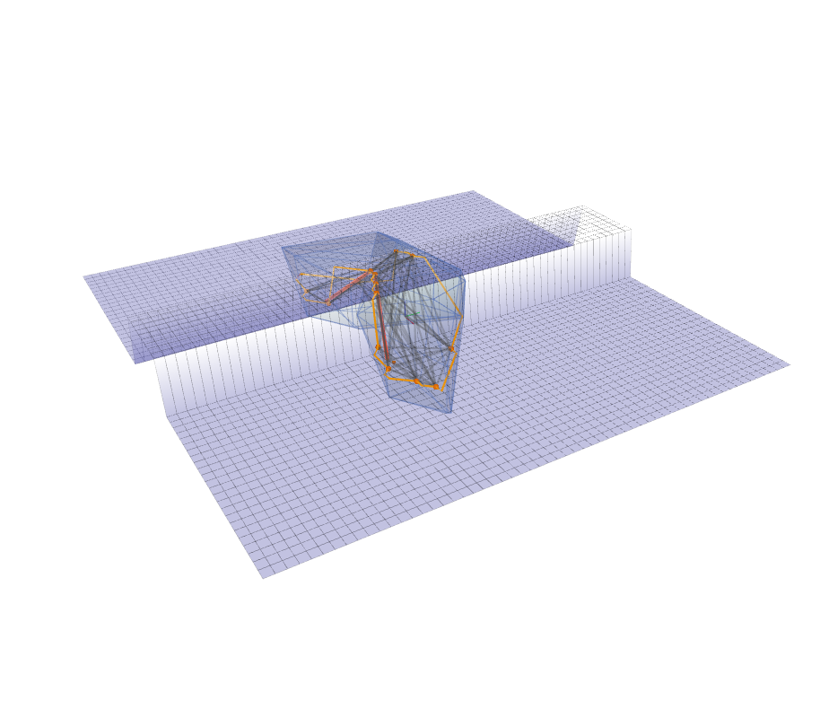
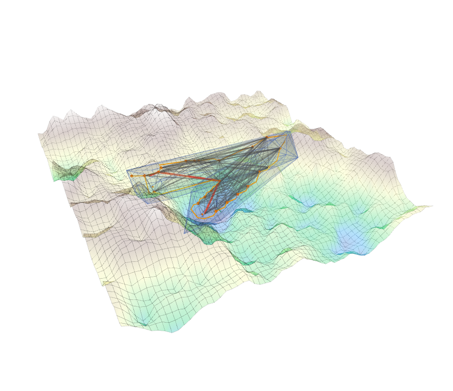
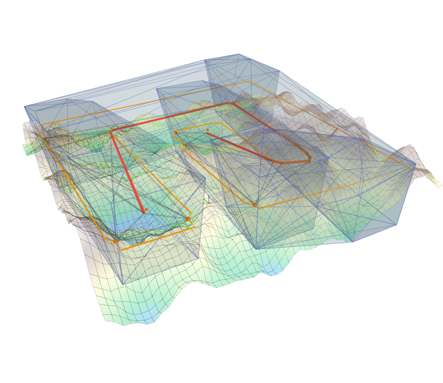

# GCS path search

## Dependencies

- CGAL: `sudo apt install libcgal-dev`

## Build

```bash
catkin build gcs_path_search -DCMAKE_BUILD_TYPE=Release
```

## Examples

### GCS path search

<table>
  <tr>
    <td></td>
    <td></td>
  </tr>
  <tr>
    <td></td>
    <td></td>
  </tr>
</table>

Example List:

- eg_guide_surface_demo
- eg_gcs_barrier_demo
- eg_gcs_rand_corridor_demo
- eg_gcs_rand_map_demo

```bash
roslaunch gcs_path_search gcs_example.launch \
example_name:=eg_guide_surface_demo
```

## Acknowledgements

- [astar-algorithm-cpp](https://github.com/justinhj/astar-algorithm-cpp)
- [Vertex Enumeration 3D](https://github.com/ZJU-FAST-Lab/VertexEnumeration3D)
